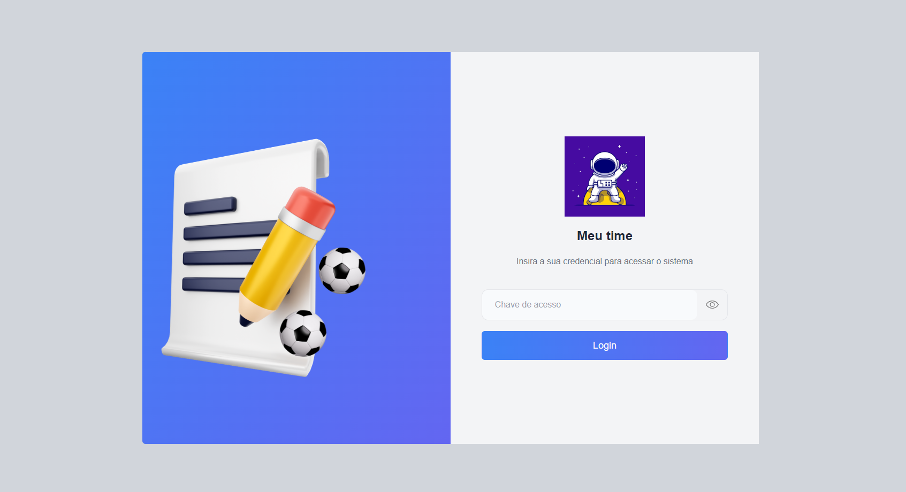

# Meu Time

Meu Time é um projeto que utiliza uma estrutura de monorepo gerenciada pelo Nx.dev, combinando tecnologias frontend e backend em um único repositório. Este projeto apresenta um aplicativo Angular no frontend, escrito em TypeScript, e um servidor Express/Node.js no backend.

## 🛠️ Tecnologias utilizadas

-  [Nx.dev](https://nx.dev/)
-  [Angular](https://angular.io/)
-  [TypeScript](https://www.typescriptlang.org/)
-  [Express](https://expressjs.com/)
-  [Node.js](https://nodejs.org/)
-  [Tailwind](https://tailwindcss.com/)

## 📦 Como instalar

Para instalar as dependências do projeto, basta executar o seguinte comando:

```bash
npm i
```

## 🚀 Como iniciar a aplicação

Para iniciar as aplicações (frontend e backend), execute o seguinte comando:

```bash
npm start
```

Este comando irá iniciar as duas aplicações em paralelo no servidor local.

## 🔑 Chave de acesso

Para acessar o sistema, a chave necessária é a seguinte:

```
4bdea2629dmsh648bf9a51aa0838p12d1ccjsn2ff47de99fff
```



## 👨‍💻 Autor

<video url=(https://youtu.be/_ETVBhnFtK0)>

<video width="400" controls>
  <source src="https://youtu.be/_ETVBhnFtK0" type="video/mp4">
Usando o aplicativo
</video>

[Hallison Brancalhão](https://brancalhao.com.br)

💻🚀
